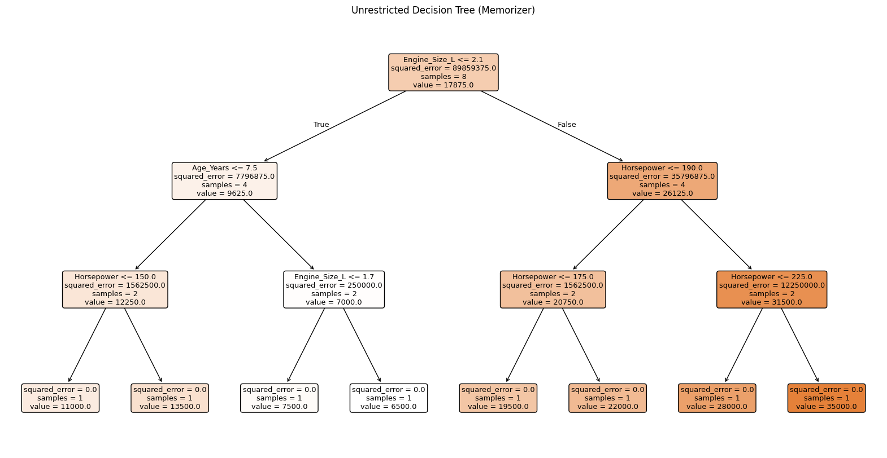

# Decision Trees: Overfitting vs Generalization

## Overview

This experiment explores how model complexity affects overfitting and generalization in machine learning.

Using decision tree regression, I compare an unrestricted decision tree that memorizes training data with a constrained tree that is forced to learn more general patterns. A linear regression model is also included as a simple baseline for comparison.

The purpose of this notebook is to demonstrate why low training error alone is not a reliable indicator of model quality.

---

## Dataset

A small synthetic dataset representing used car prices was created for this experiment.

Each data point includes the following features:

* Mileage
* Age (years)
* Horsepower
* Engine size (liters)
* Fuel efficiency (MPG)

The target variable is the car price.

The dataset is intentionally small so that overfitting behavior is easy to observe and reason about.

---

## Models Compared

The following models are trained and evaluated:

1. **Unrestricted Decision Tree (Memorizer)**

   * No limits on depth or splits
   * Achieves very low training error
   * Poor generalization performance

2. **Constrained Decision Tree (Learner)**

   * Limited depth and minimum samples per split
   * Higher training error than the memorizer
   * Better validation performance

3. **Linear Regression (Baseline)**

   * Simple, high-bias model
   * Used as a reference point for comparison

---

## Methodology

* The dataset is split into training and validation sets
* Models are evaluated using Mean Absolute Error (MAE)
* Training and validation errors are compared to assess generalization
* Decision tree structures are analyzed to understand model behavior

To keep the notebook lightweight, the full visualization of the unrestricted decision tree is saved as an image file instead of being rendered inline.

---

## Decision Tree Visualization

The unrestricted decision tree becomes very large and difficult to interpret due to overfitting.

The full tree visualization is saved as an image:



The constrained decision tree is visualized directly in the notebook since it is smaller and easier to interpret.

---

## Key Observations

* An unrestricted decision tree can perfectly fit training data but fails to generalize
* Constraining model complexity improves performance on unseen data
* Lower training error does not necessarily indicate a better model
* Simpler models such as linear regression provide useful baselines

---

## Files in This Directory

```
decision-trees-overfitting/
├── decision_trees_overfitting_vs_generalization.ipynb
├── memorizer_tree.png
└── README.md
```

---

## Tools Used

* Python
* Pandas
* Scikit-learn
* Matplotlib

---

## Purpose of This Experiment

This notebook is part of my machine learning foundations work and is intended to demonstrate conceptual understanding of overfitting, generalization, and model evaluation rather than model optimization or performance tuning.

---
